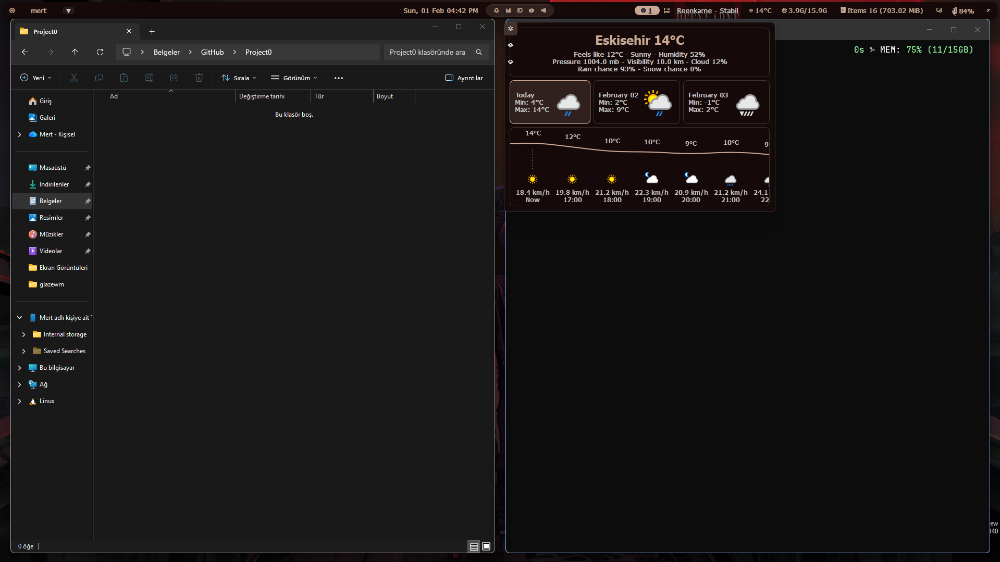
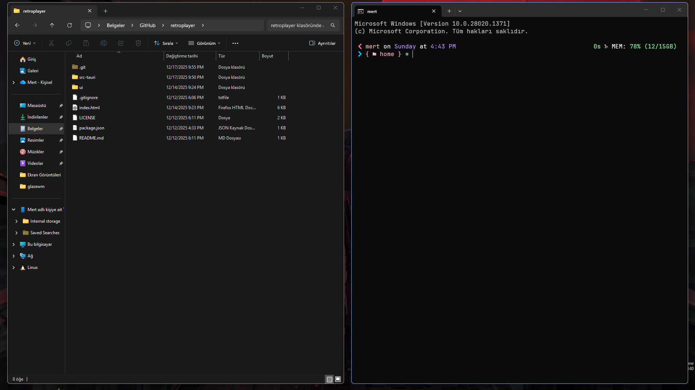
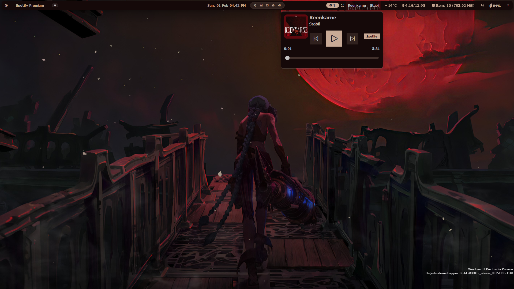
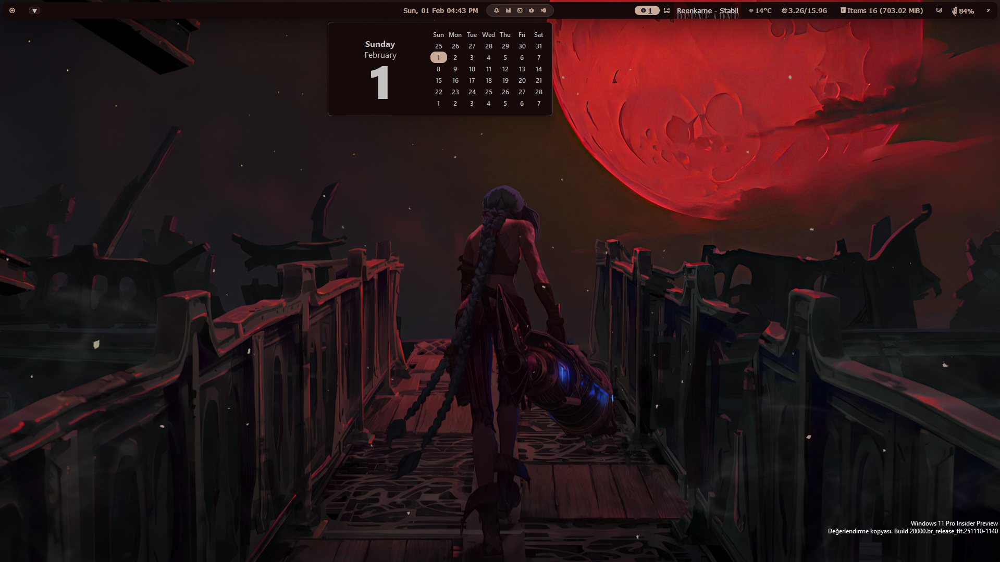

# Windows Configs (GlazeWM + YASB + AltSnap)

Bu repository, Windows ortamı için Tiling Window Manager (GlazeWM) ve Status Bar (YASB) yapılandırmalarını içerir.

## Önizleme (Previews)

| **Masaüstü (Desktop)** | **Pencere Düzeni (Tiling)** |
|:---:|:---:|
|  |  |

| **Medya Oynatıcı** | **Hava Durumu** | **Takvim** |
|:---:|:---:|:---:|
|  |  |  |

## Gereksinimler (Requirements)

Aşağıdaki araçların kurulu olması gerekmektedir:

- **[AltSnap](https://github.com/RamonUnch/AltSnap)**: Pencere taşıma ve boyutlandırma için (Alt tuşu ile).
- **[GlazeWM](https://github.com/glzr-io/glazewm)**: Tiling Window Manager.
- **[YASB (Yet Another Status Bar)](https://github.com/amnweb/yasb)**: Python tabanlı, özelleştirilebilir durum çubuğu.
- **Python 3.10+**: YASB ve scriptler için gereklidir.

## Kurulum (Installation)

1.  Bu repoyu bilgisayarınıza klonlayın:
    ```bash
    git clone https://github.com/kullaniciadi/windows-dotfiles.git
    cd windows-dotfiles
    ```

2.  **GlazeWM** yapılandırmasını kopyalayın:
    - `glazewm/config.yaml` dosyasını `%USERPROFILE%\.glzr\glazewm\` dizinine kopyalayın (veya symlink oluşturun).

3.  **YASB** yapılandırmasını kopyalayın:
    - `yasb/` klasörünün içeriğini `%USERPROFILE%\.config\yasb\` dizinine kopyalayın.
    - Eğer `yasb` klasörü yoksa oluşturun.

4.  **Python Bağımlılıkları**:
    - YASB'nin çalışması için gerekli kütüphaneleri yükleyin.
    - Ayrıca `yasb_glazewm_auto_hide.py` ve `weatherapi_fetch.py` scriptlerinin çalışması için ek paketler gerekebilir (`requests`, `pyyaml` vb.).

## Scriptler Hakkında

-   `yasb_glazewm_auto_hide.py`: Mouse barın üzerinden çekildiğinde üst boşluğu (gap) kaldırır ve barı gizler. Mouse yukarı gittiğinde barı geri getirir.
-   `start_yasb_glazewm_hidden.bat`: Arka planda scriptleri başlatmak için kullanılır.

## Notlar

-   Dosya yolları (`C:/Users/mert/...`) bazı scriptlerde hardcoded (sabit) olabilir. Kendi kullanıcı adınıza göre düzenlemeyi unutmayın.
-   Weather widget için API key `yasb/config.yaml` içindedir, kendi anahtarınızla değiştirin.
